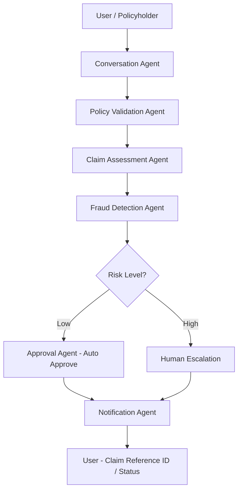

# **ClaimSwift** – Accelerating Motor Insurance Approvals with Agentic AI  🚗

  

## Welcome to **ClaimSwift**, an AI-powered assistant designed to expedite motor accident claims. By leveraging Agentic AI, ClaimSwift guides customers through the claim process, assesses damage, and automates approvals, reducing the traditional claim time from days to minutes.

## 🧩 Overview

**ClaimSwift** is an **Agentic AI-powered automation system** that reimagines the **motor insurance claim process**, reducing approval time from **7 days to just minutes**.

Built entirely using **Inya.ai’s no-code multi-agent platform**, ClaimSwift autonomously validates policy details, verifies claims, detects potential fraud, and routes cases intelligently — creating a **fast, transparent, and adaptive claim experience** for customers and insurers alike.

---

## 🎯 Problem Statement

Motor insurance claims are slow, paperwork-heavy, and prone to inefficiencies. Customers often wait **5–7 days** for even simple approvals due to manual reviews, redundant data checks, and inconsistent fraud validation.

ClaimSwift solves this by automating the entire claim lifecycle using **Agentic AI** — enabling faster decisions, better accuracy, and improved user experience.

---

## 🧠 Agentic Workflow

ClaimSwift employs **autonomous reasoning** through modular agents that collaborate in real time:

| Agent                       | Role                  | Core Function                                             |
| :-------------------------- | :-------------------- | :-------------------------------------------------------- |
| **Conversation Agent**      | Frontline interaction | Collects user details via chat or voice                   |
| **Policy Validation Agent** | Verification engine   | Cross-verifies policy numbers, registration, and validity |
| **Claim Assessment Agent**  | Decision agent        | Evaluates incident details, calculates risk level         |
| **Fraud Detection Agent**   | Trust layer           | Detects anomalies using heuristic and rule-based checks   |
| **Approval Agent**          | Automation core       | Auto-approves low-risk claims or escalates complex ones   |
| **Notification Agent**      | Communication layer   | Sends reference ID and claim updates                      |

---

## 🧩 Persona Canvas – User-Centered Design

To ensure ClaimSwift solves **real user pain points**, a **Persona Canvas** was developed to identify potential users and map their needs, motivations, and frustrations.

### 👤 Primary Persona: *Rahul Mehta (34, Software Engineer)*

* **Goal:** Get his car repaired and claim insurance quickly after a minor accident.
* **Frustrations:** Lengthy approval cycles, repetitive document uploads, unclear status updates.
* **Needs:** A transparent, conversational system that validates eligibility instantly and provides clear claim tracking.
* **Scenario:** Rahul files a claim using ClaimSwift’s chat interface, uploads the required details, and receives an instant approval ID within minutes.

### 👥 Secondary Personas

| Persona                              | Description                                | Key Need                                          |
| :----------------------------------- | :----------------------------------------- | :------------------------------------------------ |
| **Insurance Customer Support Agent** | Handles 50+ calls daily about claim status | Wants automation to reduce repetitive queries     |
| **Garage/Service Partner**           | Submits damage estimates                   | Needs faster claim confirmations to start repairs |
| **Insurance Manager**                | Reviews claim queues manually              | Seeks reliable auto-screening and fraud alerts    |

By integrating these insights into ClaimSwift’s workflow, the system was designed for **usability, empathy, and scalability**, ensuring every stakeholder benefits from automation.

---

## ⚙️ Architecture Diagram

---

## 💬 Key Features

* 💡 **Conversational Interface:** Chat or voice-based, guided filing
* ⚙️ **End-to-End Automation:** From claim initiation to approval
* 🔍 **Fraud Detection:** Detects anomalies and potential misuse
* ⚡ **Instant Auto-Approvals:** For low-risk claims
* 🧠 **Smart Escalation:** Automatically routes complex claims to humans
* 🧾 **Mock Integrations:** Simulated insurer and garage APIs

---

## 🧪 Testing Highlights

| Metric                       | Result         | Description                         |
| :--------------------------- | :------------- | :---------------------------------- |
| **Processing Speed**         | ⏱️ < 2 minutes | Claim-to-approval ID generation     |
| **Automation Coverage**      | 85%            | Fully automated for low-risk claims |
| **Human Intervention**       | ↓70%           | Only for flagged or complex claims  |
| **Fraud Detection Accuracy** | ~90%           | Based on heuristic validation       |

---

## 💥 Impact

✅ **Processing Time:** Reduced from 7 days → minutes
✅ **Customer Experience:** Transparent, conversational, and fast
✅ **Operational Load:** 70% fewer manual interventions
✅ **Scalability:** Extendable to **health, travel, and property insurance**

---

## 🧰 Tech Stack

| Component       | Technology                                                  |
| :-------------- | :---------------------------------------------------------- |
| **AI Platform** | [Inya.ai](https://inya.ai) – No-Code Agentic AI by Gnani.ai |
| **Interface**   | Inya conversational UI (text + voice)                       |
| **Logic Flow**  | Multi-agent orchestration                                   |
| **Data Source** | Policy and claim rules in JSON KB                           |
| **Testing**     | Mock APIs for insurer and garage systems                    |

---

## 🌍 Future Enhancements

* Integration with **real insurer APIs** for live claims
* Add **LLM-powered anomaly detection** for fraud prediction
* Support for **regional languages** & voice-first UX
* Expand to **health and travel insurance** automation

---

## 🙏 Acknowledgements

A huge thank you to:

* **NASSCOM AI** – for fostering AI innovation for real impact
* **Gnani.ai** – for the incredible Inya.ai platform and mentorship
* **HackerEarth** – for organizing a seamless Buildathon experience

---

📊 Check out the Persona Canvas here: [https://lnkd.in/g_9HqQnC](https://lnkd.in/g_9HqQnC)
📑 Presentation: [https://lnkd.in/gbHYXxRF](https://lnkd.in/gbHYXxRF)
💻 GitHub Repo: [https://lnkd.in/gBArP9zV](https://lnkd.in/gBArP9zV)

## 🏁 Conclusion

**ClaimSwift** showcases how **Agentic AI** can **redefine claim automation** — combining reasoning, autonomy, and empathy.

By focusing on **real user personas**, **autonomous decision-making**, and **human-in-the-loop escalation**, ClaimSwift envisions a future where **insurance claims are instant, intelligent, and stress-free.**

## 📸 Screenshot

*Interactive chat interface guiding users through the claim process.*
